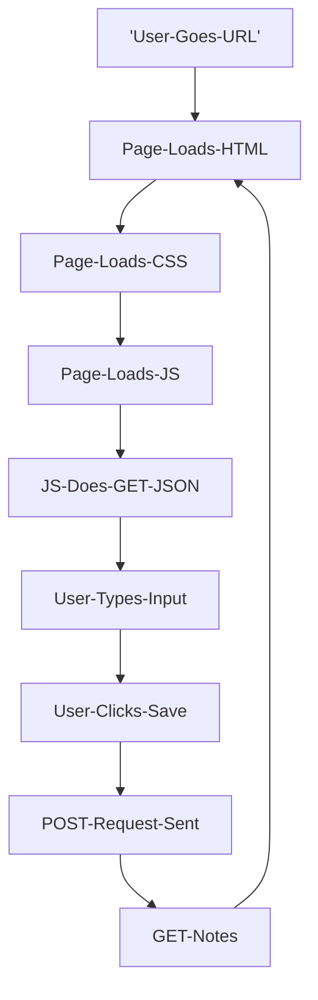

```mermaid
graph TD;
    'User-Goes-URL'
    -->Page-Loads-HTML
    -->Page-Loads-CSS
    -->Page-Loads-JS
    -->JS-Does-GET-JSON
    -->User-Types-Input
    -->User-Clicks-Save
    -->POST-Request-Sent
    -->GET-Notes
    -->Page-Loads-HTML
```